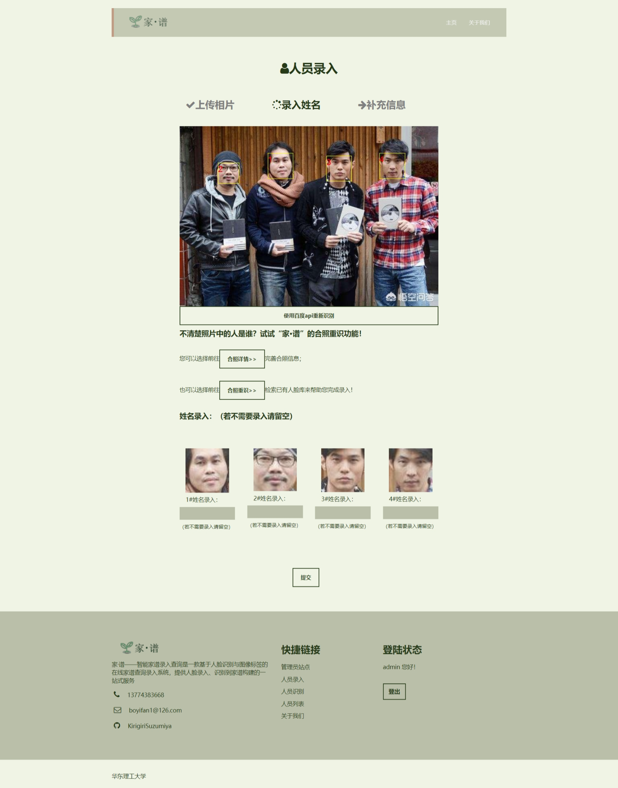
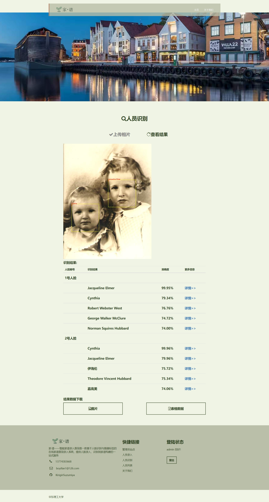

# family-tree
家·谱——智能家谱录入查询是一款基于人脸识别与图像标签的在线家谱查询录入系统，提供人脸录入、识别到家谱构建的一站式web服务平台。使用django+python+face_recognition+BaiduAPI。

## 🔥最新动态

- **2025.1**  人物轨迹功能上线，现在能够在人物详情地图上统一查看合照拍摄位置与人物位置，并生成历史轨迹。
- **2024.12**  原gradio ocr工具重构，整合成为ai-tools子服务，并支持大语言模型流式输出与RAG检索福州老建筑数据库。


## 功能

#### 1. **人员录入**

作为系统的入口，通过web服务接口实现数据平台的访问，由管理人员/访客上传需要数字化的资源并经由服务端实时处理进行初步的自动化筛选。该功能一共分为三个步骤——上传相片、录入姓名、补充信息。

- 上传相片

可以在此处上传需要录入人员的照片，可以是多人合照也可以是单人照，之后系统会找出相片中的可识别人脸并进入下一步。

-  录入姓名

格式化展示从上一步所上传图片中识别出的人脸，并为每一个人脸提供一个输入框以录入姓名，提交后人脸将会被编码成128维数组并存入服务端。之后可以在人脸列表中查询与添加更多信息。

-  补充信息

这是完成录入姓名后的一个跳转页面，能够方便的跳转到人员的详情页面以编辑和补全信息并使用地图标点与自动家谱构建等功能。



#### 2. **人员识别**

上传一张相片，可以是单人或者多人合照。随后返回与已存储人人脸的比对结果，并提供详情跳转。

- 上传相片

  可以在此处上传需要识别人员的照片，可以是多人合照也可以是单人照，之后系统会找出相片中的人脸并与已录入的人脸进行比对。

- 查看结果

返回上一步识别的结果，提供识别结果详情页的跳转与识别数据的下载（包括识别结果的可视化图层叠加相片和EXCEL表格）。



#### 3. **人员列表**

为所有已经录入的人员提供一个统一查询与编辑的入口，同时提供更多详细资料的上传与展示功能。包括人员一览、人员概述、地图标点、家谱展示、图像列表、编辑信息等功能


#### 4. 其他支持功能

- 用户登录注册
- 后台数据管理
- ……

## 环境

python3.6及以上

#### windows 配置

```python
pip install cmake
pip install dlib
pip install face_recogniton
pip install django
pip install xlwt
pip install pypinpyin
pip install pyecharts
安装 Graphviz
```

#### linux 配置

```
sudo apt-get install build-essential cmake
sudo apt-get install libgtk-3-dev
sudo apt-get install libboost-all-dev 
sudo apt-get install graphviz
pip install dlib -vv
pip install pandas
pip install face_recognition
pip install django
pip install xlwt	
pip install pypinpyin
pip install pyecharts
```

## 配置API

前往百度智能云申请免费的人脸识别资源并获取api_key和密钥

并将他们填在`cv/baidu_key.txt`中

## 运行

```
cd cv
python manage.py runserver 0.0.0.0:80
```
